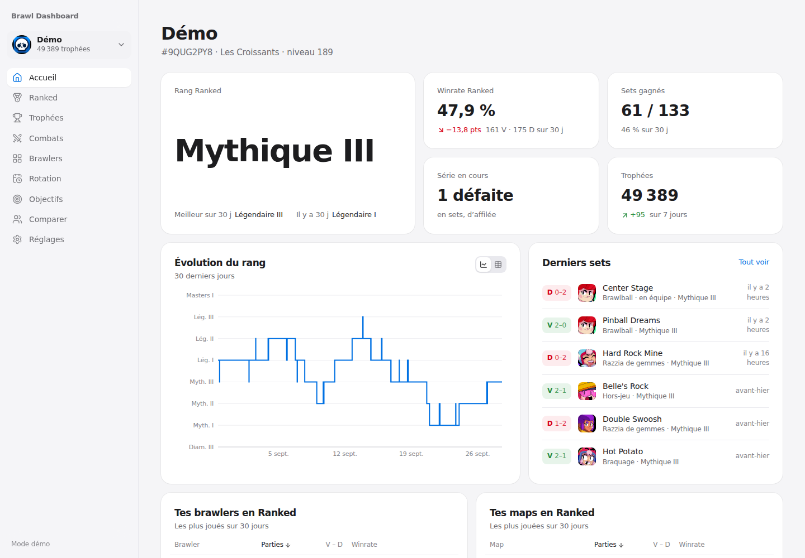
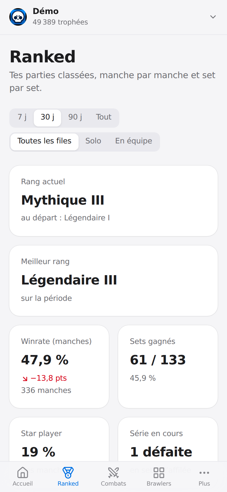

# Brawl Dashboard

Un dashboard **local et privé** pour suivre ton compte Brawl Stars grâce à l'API officielle (gratuite) :
rang Ranked, trophées, combats, collection, rotation des maps, objectifs et comparaison avec tes potes.
Il tourne sur ton Mac et s'ouvre aussi sur ton téléphone, sur le même Wi-Fi.



<p align="center"></p>

## Ce qu'il fait

- **Accueil centré sur le Ranked** : rang actuel, winrate et écart avec le mois précédent, sets gagnés, série en cours,
  évolution du rang, derniers sets, tes brawlers et tes maps, dernière session, objectifs.
- **Ranked** : sets BO3 reconstitués (2–0, 2–1…), winrate par brawler et par map, brawlers adverses, coéquipiers
  réguliers, meilleurs picks par map, historique des sets avec les compositions d'équipe.
- **Trophées** : courbe dans le temps, variation jour par jour, progression de chaque brawler.
- **Combats** : historique complet et filtrable (type, mode, brawler, map), stats par mode, map, brawler et
  adversaire, sessions de jeu.
- **Brawlers** : collection complète, gadgets / star powers / hypercharges / gears, brawlers manquants et
  **coût restant en pièces et points de puissance pour tout maxer**.
- **Rotation** : les maps du moment, avec les brawlers qui te réussissent le mieux dessus d'après ton historique.
- **Objectifs** : trophées, rang Ranked, brawler, niveau 11… avec une date d'arrivée estimée d'après ton rythme.
- **Comparer** : tes autres comptes et ceux de tes potes, côte à côte.

## Installation (environ 5 minutes)

### 1. Prérequis

- **Node.js 22.13 ou plus récent** (conseillé : 24 LTS). Sur Mac : `brew install node`, ou l'installateur de
  [nodejs.org](https://nodejs.org). Vérifie avec `node -v`.
- Un **compte développeur gratuit** sur [developer.brawlstars.com](https://developer.brawlstars.com) : clique sur
  *Register*, puis confirme ton email. Inutile de créer une clé à la main, l'app s'en occupe (voir plus bas).

### 2. Récupérer le projet

```bash
git clone https://github.com/gabrielsagot/api_bs.git
cd api_bs
npm install
```

### 3. Configurer

```bash
cp .env.example .env
```

Ouvre `.env` et remplis :

```ini
BS_DEV_EMAIL=ton.email@exemple.com
BS_DEV_PASSWORD='ton mot de passe'
BS_PLAYER_TAG=2PP0YC8
```

- Le **tag** s'écrit **sans le `#`** : dans un fichier `.env`, `#` démarre un commentaire. Il est affiché sous ton
  pseudo, dans ton profil en jeu. Tu peux aussi l'ajouter plus tard depuis l'interface.
- Mets le mot de passe **entre guillemets simples** s'il contient `#`, un espace ou des guillemets.
- Le fichier `.env` est ignoré par Git : tes identifiants ne partent jamais sur GitHub.

### 4. Lancer

```bash
npm start
```

Puis ouvre **http://localhost:4777**. Le terminal affiche aussi l'adresse à ouvrir sur ton téléphone.

> Envie de voir à quoi ça ressemble sans rien configurer ? Lance `npm run demo` : l'app génère 45 jours de données
> fictives pour 3 joueurs.

## La clé API, gérée toute seule

Les clés de l'API Brawl Stars sont **verrouillées sur une adresse IP publique**. Si ta box change d'IP, une clé
classique cesse de fonctionner. Avec `BS_DEV_EMAIL` et `BS_DEV_PASSWORD`, l'app :

1. se connecte au portail développeur et détecte l'IP vue par Supercell ;
2. réutilise sa clé `brawl-dashboard` si elle correspond à cette IP, sinon en crée une nouvelle ;
3. si l'API refuse la clé (IP changée), en recrée une automatiquement et relance la requête.

Un compte développeur a droit à **10 clés maximum**. Quand la limite est atteinte, l'app supprime uniquement ses
**propres** anciennes clés (celles nommées `brawl-dashboard`), jamais celles que tu as créées à la main.
L'état de la clé est visible dans **Réglages**, avec un bouton pour la recréer.

**Autres options** (dans `.env`) :

- **Clé manuelle** : laisse email et mot de passe vides et renseigne `BS_API_KEY`. Si ton IP change, les Réglages
  affichent la nouvelle IP à déclarer sur le portail.
- **Proxy communautaire RoyaleAPI** : crée une clé autorisant l'IP `45.79.218.79`, puis mets
  `BS_API_BASE_URL=https://bsproxy.royaleapi.dev/v1` et `BS_API_KEY=…`. Ça marche quelle que soit ton IP, mais tes
  requêtes passent par un service tiers.

## Sur ton téléphone

1. Ton téléphone doit être sur **le même Wi-Fi** que le Mac.
2. Ouvre l'adresse affichée au lancement (ex. `http://192.168.1.23:4777`), ou scanne le **QR code** dans **Réglages**.
3. Au premier lancement, macOS peut demander d'autoriser Node à recevoir des connexions : accepte. Sinon, va dans
   Réglages Système › Réseau › Coupe-feu.
4. Dans Safari : **Partager › Sur l'écran d'accueil** pour l'ouvrir comme une app.

Toute personne connectée à ton Wi-Fi peut ouvrir le dashboard. Ce ne sont que des données publiques du jeu, et la clé
API n'est jamais envoyée au navigateur. Pour réserver l'accès au Mac, mets `HOST=127.0.0.1` dans `.env`.

## Le lancer automatiquement au démarrage du Mac

L'API ne garde que tes **25 derniers combats** : plus le dashboard tourne, plus ton historique est complet.
Pour qu'il démarre tout seul à chaque ouverture de session :

```bash
./scripts/macos-autostart.sh install     # installe et démarre le service
./scripts/macos-autostart.sh restart     # après une mise à jour du code (git pull)
./scripts/macos-autostart.sh logs        # suivre le journal
./scripts/macos-autostart.sh uninstall   # tout retirer (tes données sont conservées)
```

Quand le Mac est en veille, la collecte est en pause. Pour une collecte continue sur secteur, active
*Réglages Système › Batterie › Options › Empêcher la suspension automatique lorsque l'écran est éteint*.

## Bon à savoir

- **L'historique démarre au premier lancement.** L'API ne fournit ni historique de trophées ni vieux combats. Le
  dashboard interroge l'API toutes les 2 min pendant que tu joues et toutes les 10 min au repos (réglable avec
  `POLL_ACTIVE_SECONDS` et `POLL_IDLE_SECONDS`). Si tu joues plus de 25 parties pendant qu'il est éteint, les plus
  anciennes sont perdues.
- **Ranked** : l'API ne donne pas tes points de classement. Le rang (Bronze I → Pro) est lu dans tes parties classées,
  et les sets BO3 sont reconstitués en regroupant les manches jouées contre les mêmes adversaires.
- **Piège de l'API** : le type de combat `ranked` désigne en réalité les parties de **trophées**. Le mode Ranked
  apparaît sous `soloRanked` et `teamRanked`. Le dashboard fait la différence pour toi.
- **Images** : l'API officielle n'en fournit aucune. Les portraits viennent du CDN communautaire Brawlify et sont mis en
  cache dans `data/img`. La rareté des brawlers vient aussi de Brawlify, et le dashboard fonctionne sans.
- **Coûts d'amélioration** : les prix (niveaux, gadgets, star powers, hypercharges) sont dans
  `server/stats/costs.ts`. À ajuster si Supercell change l'économie du jeu.
- **Tes données** sont dans `data/brawl.sqlite`. Pour les sauvegarder, copie le dossier `data/`.

## Dépannage

| Problème | Solution |
| --- | --- |
| « Identifiants refusés par developer.brawlstars.com » | Vérifie email et mot de passe dans `.env` (guillemets si le mot de passe contient `#`). |
| « Clé refusée pour l'IP … » | Mode manuel : ajoute cette IP à ta clé sur le portail, ou passe en gestion automatique. |
| « Node.js … est trop ancien » | Mets Node à jour (`brew upgrade node`). |
| « Le port 4777 est déjà utilisé » | L'app tourne déjà (service auto ?), sinon change `PORT` dans `.env`. |
| Le téléphone n'arrive pas à se connecter | Même Wi-Fi, coupe-feu macOS, et `HOST=0.0.0.0` dans `.env`. |
| « Aucun joueur avec le tag … » | Vérifie le tag : il ne contient que les caractères `0 2 8 9 P Y L Q G R J C U V`. |

## Développement

```bash
npm run dev         # API + interface avec rechargement à chaud → http://localhost:5173
npm test            # tests unitaires (Vitest)
npm run typecheck   # vérification TypeScript
```

- `server/` : API locale (Fastify) et collecte. Base SQLite intégrée à Node (`node:sqlite`), donc aucune dépendance
  native à compiler. La gestion de la clé est dans `server/brawlstars/keys.ts`, les statistiques dans `server/stats/`.
- `web/` : interface React + Vite + Tailwind CSS, graphiques Recharts.
- `shared/` : types et libellés partagés entre le serveur et l'interface.

---

Ce contenu n'est pas affilié à, approuvé, sponsorisé ou spécifiquement validé par Supercell, et Supercell n'en est pas
responsable. Pour plus d'informations, consulte la
[politique de Supercell relative au contenu des fans](https://www.supercell.com/fan-content-policy).
